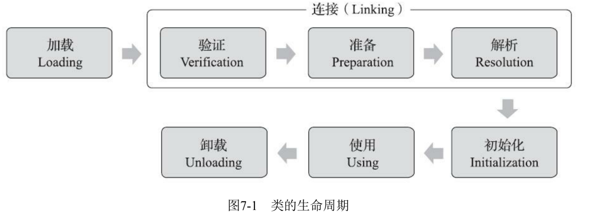
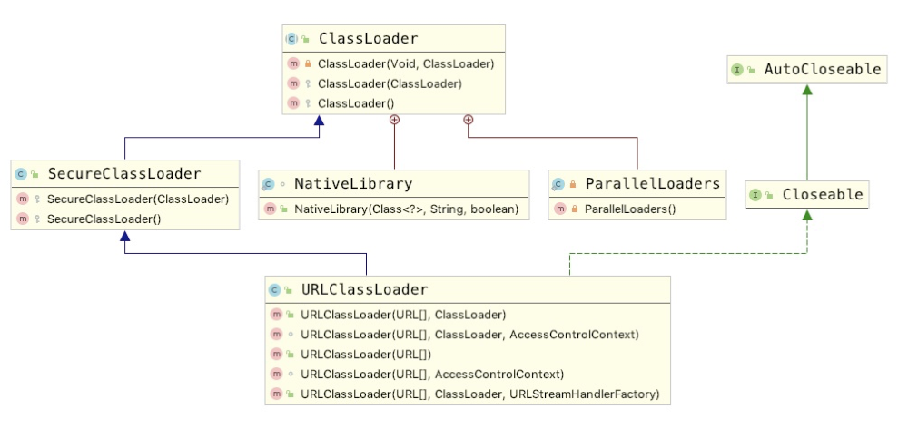
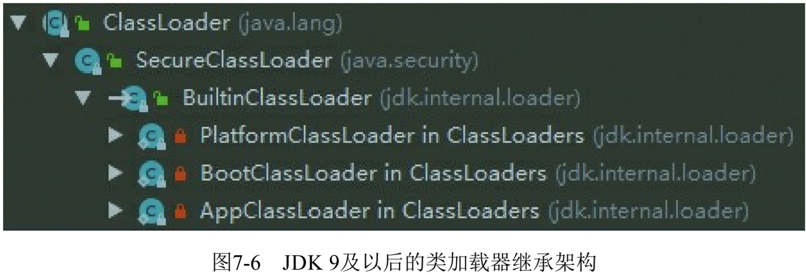
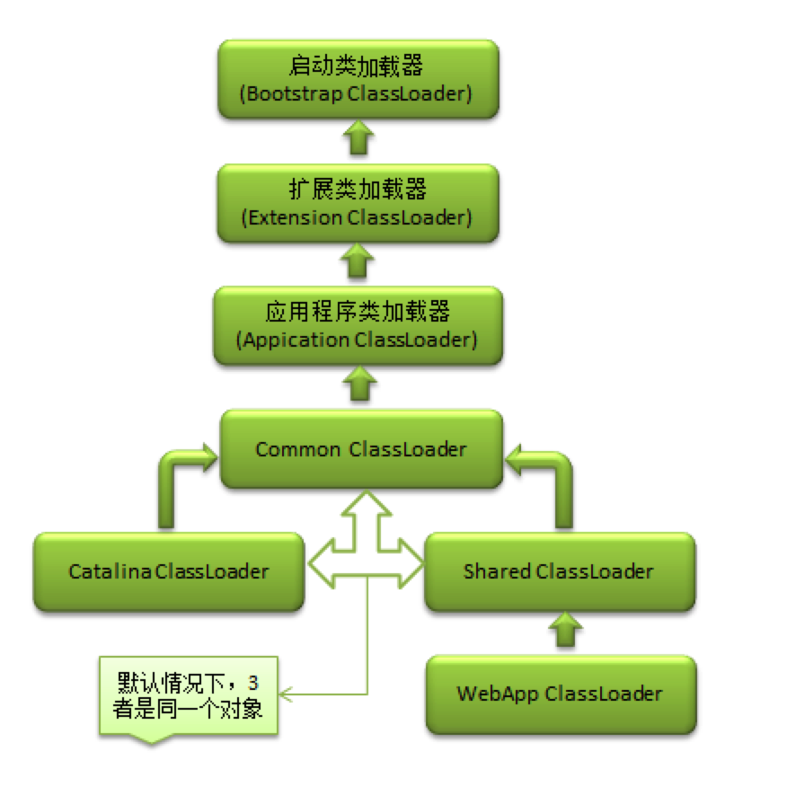

# java的类加载

摘要：

​	java类加载机制   类加载过程详解   类加载器介绍  双亲委派模型 双亲委派模型破坏等……

​	ps：下一内容出自于深入理解java虚拟机初中

#### 类加载的时机

​	一个类型从被加载到虚拟机内存中开始，到卸载出内存为止，它的整个生命周期将会经历加载 （Loading）、验证（Verification）、准备（Preparation）、解析（Resolution）、初始化 （Initialization）、使用（Using）和卸载（Unloading）七个阶段，其中验证、准备、解析三个部分统称 为连接（Linking）




这些阶段通常都 是互相交叉地混合进行的，会在一个阶段执行的过程中调用、激活另一个阶段。 

一下为触发类加载的时机：

1）遇到new、getstatic、putstatic或invokestatic这四条字节码指令时，如果类型没有进行过初始化，则需要先触发其初始化阶段。能够生成这四条指令的典型Java代码场景有： 

- 使用new关键字实例化对象的时候。 
- 读取或设置一个类型的静态字段（**被final修饰、已在编译期把结果放入常量池的静态字段除外**） 的时候。
- 调用一个类型的静态方法的时候。 

2）使用java.lang.reflect包的方法对类型进行反射调用的时候，如果类型没有进行过初始化，则需要先触发其初始化。

3）当初始化类的时候，如果发现其父类还没有进行过初始化，则需要先触发其父类的初始化。 

4）当虚拟机启动时，用户需要指定一个要执行的主类（包含main()方法的那个类），虚拟机会先 初始化这个主类。 

5）当使用JDK 7新加入的动态语言支持时，如果一个java.lang.invoke.MethodHandle实例最后的解析结果为REF_getStatic、REF_putStatic、REF_invokeStatic、REF_newInvokeSpecial四种类型的方法句柄，并且这个方法句柄对应的类没有进行过初始化，则需要先触发其初始化。 

6）当一个接口中定义了JDK 8新加入的默认方法（被default关键字修饰的接口方法）时，如果有 这个接口的实现类发生了初始化，那该接口要在其之前被初始化。 


#### 类加载过程

##### 1.加载

​		“加载”（Loading）阶段是整个“类加载”（Class Loading）过程中的一个阶段，希望读者没有混淆 这两个看起来很相似的名词。在加载阶段，Java虚拟机需要完成以下三件事情： 

1）通过一个类的全限定名来获取定义此类的二进制字节流。 

2）将这个字节流所代表的静态存储结构转化为方法区的运行时数据结构。 

3）在内存中生成一个代表这个类的java.lang.Class对象，作为方法区这个类的各种数据的访问入口。

##### 2.验证

​	验证是连接阶段的第一步，这一阶段的目的是确保Class文件的字节流中包含的信息符合《Java虚拟机规范》的全部约束要求，保证这些信息被当作代码运行后不会危害虚拟机自身的安全。

​	这阶段的验证是基于二进制字节流进行的，只有通过了这个阶段的 验证之后，这段字节流才被允许进入**Java虚拟机内存的方法区中**进行存储，所以后面的三个验证阶段 全部是基于方法区的存储结构上进行的，不会再直接读取、操作字节流了。

##### 3.准备

​	准备阶段是正式为类中定义的变量（即静态变量，被static修饰的变量）分配内存并设置类变量初 始值的阶段，从概念上讲，这些变量所使用的内存都应当在方法区中进行分配，但必须注意到方法区本身是一个逻辑上的区域，在JDK 7及之前，HotSpot使用永久代来实现方法区时，实现是完全符合这种逻辑概念的；而在JDK 8及之后，类变量则会随着Class对象一起存放在Java堆中。

##### 4.解析

​	解析阶段是Java虚拟机将常量池内的**符号引用**替换为**直接引用**的过程

##### 5.初始化

​	初始化阶段就是执行类构造器<clinit>()方法的过程。给准备阶段定义的变量赋值

<clinit>()方法与**类的构造函数（**即在虚拟机视角中的实例构造器<init>()方法）不同，它不需要显 式地调用父类构造器，Java虚拟机会保证在子类的<clinit>()方法执行前，父类的<clinit>()方法已经执行 完毕。因此在Java虚拟机中第一个被执行的<clinit>()方法的类型肯定是java.lang.Object。 


#### 什么是java的类加载器？

​		老样子 写在前边，原始文档参考oracle JDK文档：[注释学习](https://docs.oracle.com/javase/tutorial/java/annotations/index.html)

​        定义：**Java类加载器**（英语：Java Classloader）是Java运行时环境（Java Runtime Environment）的一部分，负责[动态加载](https://baike.baidu.com/item/动态加载)Java类到[Java虚拟机](https://baike.baidu.com/item/Java虚拟机)的内存空间中。类通常是按需加载，即第一次使用该类时才加载。由于有了类加载器，Java运行时系统不需要知道文件与文件系统。学习类加载器时，掌握Java的委派概念很重要。


​		类加载器虽然只用于实现类的加载动作，但它在Java程序中起到的作用却远超类加载阶段。对于 任意一个类，都必须由加载它的类加载器和这个类本身一起共同确立其在Java虚拟机中的唯一性，每 一个类加载器，都拥有一个独立的类名称空间。这句话可以表达得更通俗一些：**比较两个类是否“相 等”，只有在这两个类是由同一个类加载器加载的前提下才有意义，否则，即使这两个类来源于同一个 Class文件，被同一个Java虚拟机加载，只要加载它们的类加载器不同，那这两个类就必定不相等**。


​	   这里所指的“相等”，包括代表类的Class对象的equals()方法、isAssignableFrom()方法、isInstance() 方法的返回结果，也包括了使用instanceof关键字做对象所属关系判定等各种情况。如果没有注意到类加载器的影响，在某些情况下可能会产生具有迷惑性的结果


#### java中的类加载器

每个Java类必须由某个类加载器装入到内存。Java程序可以利用外部库（即由其他作者编写的软件库）。

JVM中有3个默认的类加载器：

1. 引导（Bootstrap）类加载器。由原生代码（如C语言）编写，**不继承**自java.lang.ClassLoader。负责加载核心Java库，存储在<JAVA_HOME>/jre/lib目录中。
2. 扩展（Extensions）类加载器。用来在<JAVA_HOME>**/jre/lib/ext**,或**java.ext.dirs**中指明的目录中加载 Java的扩展库。Java 虚拟机的实现会提供一个扩展库目录。该类加载器在此目录里面查找并加载 Java 类。该类由**sun.misc.Launcher$ExtClassLoader实现**。
3. Apps类加载器（也称系统类加载器 - system/appliatcion classLoader）。根据 Java应用程序的类路径（java.class.path或CLASSPATH环境变量）来加载 Java 类。一般来说，Java 应用的类都是由它来完成加载的。可以通过 ClassLoader.getSystemClassLoader()来获取它。**该类由sun.misc.Launcher$AppClassLoader实现。**

每个类装载器有一个父装载器（parent class loader）。 


除了以上jvm中3个默认的类加载器，用户还可以自定义类加载器：

自定义类加载器（custom class loader）：

​		除了系统提供的类加载器以外，开发人员可以通过继承 java.lang.ClassLoader类的方式实现自己的类加载器，以满足一些特殊的需求。


从以下代码中可以看出，系统中的java默认加载器为 System/Application ClassLoader ，父类加载器为ExtClassLoader

```java
public static void main(String[] args) {
    ClassLoader systemClassLoader = ClassLoader.getSystemClassLoader();
    System.out.println("systemClassLoader = " + systemClassLoader);
    System.out.println("systemClassLoader parent = "+ systemClassLoader.getParent());
    System.out.println("systemClassLoader parent parent = "+systemClassLoader.getParent().getParent());
}
// systemClassLoader = sun.misc.Launcher$AppClassLoader@18b4aac2
// systemClassLoader parent = sun.misc.Launcher$ExtClassLoader@161cd475
// systemClassLoader parent parent = null
```




// java 启动类中，可以看出  Thread.currentThread().setContextClassLoader(this.loader);   线程上下文加载器默认为System/Application classLoader

```java
public Launcher() {
    Launcher.ExtClassLoader var1;
    try {
        var1 = Launcher.ExtClassLoader.getExtClassLoader(); // extClassLoader
    } catch (IOException var10) {
        throw new InternalError("Could not create extension class loader", var10);
    }

    try {
        this.loader = Launcher.AppClassLoader.getAppClassLoader(var1);// appClassLoader
    } catch (IOException var9) {
        throw new InternalError("Could not create application class loader", var9);
    }

    Thread.currentThread().setContextClassLoader(this.loader);// appClassLoader
    .... 

}
```


#### 双亲委派模式

##### 	加载机制:

​			某个特定的类加载器在接到加载类的请求时，首先将加载任务委托交给父类加载器，父类加载器又将加载任务向上委托，直到最父类加载器，如果最父类加载器可以完成类加载任务，就成功返回，如果不行就向下传递委托任务，由其子类加载器进行加载。

##### 	为啥要有双亲委派这种模式：

​			使用双亲委派模型的好处在于Java类随着它的类加载器一起具备了一种带有优先级的层次关系。

​			例如类java.lang.Object，它存在在rt.jar中，无论哪一个类加载器要加载这个类，最终都是委派给处于模型最顶端的Bootstrap ClassLoader进行加载，因此Object类在程序的各种类加载器环境中都是同一个类。

##### 	java如何实现双亲委派模式

​			ClassLoader类中loadClass逻辑中来实现的，分为三步

1. ​	调用findLoadedClass(String)以检查是否已加载该类
2. ​    在父类加载器上调用loadClass方法。 如果父级为null ，则使用虚拟机内置的类加载器。
3. ​    调用findClass(String)方法以查找类。

```java
protected Class<?> loadClass(String name, boolean resolve) throws ClassNotFoundException
{
    synchronized (getClassLoadingLock(name)) {
        // First, check if the class has already been loaded
        Class<?> c = findLoadedClass(name);
        if (c == null) {
            long t0 = System.nanoTime();
            try {
                if (parent != null) {
                    c = parent.loadClass(name, false);
                } else {
                    c = findBootstrapClassOrNull(name);
                }
            } catch (ClassNotFoundException e) {
                // ClassNotFoundException thrown if class not found
                // from the non-null parent class loader
            }

            if (c == null) {
                // If still not found, then invoke findClass in order
                // to find the class.
                long t1 = System.nanoTime();
                c = findClass(name);

                // this is the defining class loader; record the stats
                sun.misc.PerfCounter.getParentDelegationTime().addTime(t1 - t0);
                sun.misc.PerfCounter.getFindClassTime().addElapsedTimeFrom(t1);
                sun.misc.PerfCounter.getFindClasses().increment();
            }
        }
        if (resolve) {
            resolveClass(c);
        }
        return c;
    }
}
```

 findClass一般都是自己实现的，如果没有找到则抛出 classNotFoundException

```java
// URLClassLoader 中findClass的实现，当我们自定义classLoader时也可以按照此方法实现自己的classLoader
protected Class<?> findClass(final String name)
    throws ClassNotFoundException
{
    final Class<?> result;
    try {
        result = AccessController.doPrivileged(
            new PrivilegedExceptionAction<Class<?>>() {
                public Class<?> run() throws ClassNotFoundException {
                    String path = name.replace('.', '/').concat(".class");
                    Resource res = ucp.getResource(path, false);
                    if (res != null) {
                        try {
                            return defineClass(name, res);
                        } catch (IOException e) {
                            throw new ClassNotFoundException(name, e);
                        }
                    } else {
                        return null;
                    }
                }
            }, acc);
    } catch (java.security.PrivilegedActionException pae) {
        throw (ClassNotFoundException) pae.getException();
    }
    if (result == null) {
        throw new ClassNotFoundException(name);
    }
    return result;
}
```


#### 思考，是否所有的java类加载都适用双亲委派模式

##### 双亲委派模型适应场景

​		双亲委派模型解决了各个类加载器协作时，基础类型的一致性问题（越基础的类由上层的加载器进行加载），基础类型之所以称之为基础，是因为他们总是作为被用户代码继承。

##### 	双亲委派模型与线程上下文类加载器

​	当有基础类型要调用用户的代码，那该怎么解决，比如JNDI服务，它是java的基础服务，用于对资源进行查找和集中管理，它需要调用各个厂商自己的实现，而各个厂商自己的实现都在ClassPath下JNDI服务提供接口（Service Provider Interface SPI）代码中，为了解决这个问题，java设计了一个解决方案

  Thread.currentThread().setContextClassLoader(this.loader);   // System/app ClassLoader

 	**线程上下文加载类加载器（Thread Context ClassLoader）**这个类加载器可以通过java.lang.Thread类的setContextClassLoader()方法进行设置，如果创建线程时还未设置，他将会从父线程中继承一个，如果在应用程序的全局范围内都没有设置过的话，这个类加载器默认就是 应用程序类加载器。

​	有了线程上下文类加载器，程序就可以做一些“舞弊”的事情了。JNDI服务使用这个线程上下文类 加载器去加载所需的SPI服务代码，这是一种**父类加载器去请求子类加载器完成类加载的行为**，这种行 为实际上是打通了双亲委派模型的层次结构来逆向使用类加载器，已经违背了双亲委派模型的一般性 原则，但也是无可奈何的事情。Java中涉及SPI的加载基本上都采用这种方式来完成，例如JNDI、 JDBC、JCE、JAXB和JBI等。不过，**当SPI的服务提供者多于一个的时候，代码就只能根据具体提供 者的类型来硬编码判断**，为了消除这种极不优雅的实现方式，在JDK 6时，JDK提供了 java.util.ServiceLoader类，**以META-INF/services中的配置信息**，辅以**责任链模式**，这才算是给SPI的加 载提供了一种相对合理的解决方案。 


除了上述场景 

​	譬如 OSGi实现模块化热部署的关键是它自定义的类加载器机制的实现

​			 Tomcat自己实现的类加载器


#### 	模块化系统

​		随着JDK的发展，JDK9中引入了Java模块化系统（Java Platform Module System jpms）是Java的一次重要升级，为了能够实现模块化的关键目标，可配置的封装隔离机制，Java虚拟机对类加载器架构也做了相应的变动调整；

​		

​		

​	为了使可配置的封装隔离机制能够兼容传统的类路径查找机制，JDK 9提出了与“类路 径”（ClassPath）相对应的“模块路径”（ModulePath）的概念。


#### 总结

​		java类加载机制 

​		加载 ：通过类名找到二进制文件流，并将静态存储结构转化为方法区的运行时数据结构，且生成Class对象供这个类的入口

​		验证： 通过该类的二进制流进行安全规则校验，校验通过后，才会把数据加载到运行时方法区中

​		准备： 对静态变量赋值初始值，比如int 为0 等等

​		解析： 对java常量池中的符号引用变更为直接引用

​		初始化： 执行类的构造器 <clinit> 区别于 方法构造器，此过程主要是给类属性赋值

​		使用中：程序使用

​		卸载：  卸载destory


jdk1.8 类加载器   

boostarpClassLoader  加载jre/lib目录下最基本的类

extClassLoader   加载jre/lib/ext目录下 或者 java.ext.dir 目录下

System/AppClassLoader 加载classPath下


双亲委派模型：

1. ​	调用findLoadedClass(String)以检查是否已加载该类
2. ​    在父类加载器上调用loadClass方法。 如果父级为null ，则使用虚拟机内置的类加载器（BootstarpClassLoader）。
3. ​    调用findClass(String)方法以查找类。


如何破坏双亲委派模型：

1.自定义类加载器，实现loadClass方法

2.java中线程上下文类加载器 ThreadContextClassLoader -- 父类加载器请求子类加载器去加载类，比如JDBC驱动，JNDI服务，但是如果这个类加载有规定顺序逻辑，只能通过硬编码去实现，所以JDK1.6之后推出了 SPI Service Provider Loader，辅以责任链模式，将要加载的类放到ClassPath下 META-INF/services 配置中，会扫描进行加载

3.tomcat类加载机制



​		tomcat的类加载机制是违反了双亲委托原则的，对于一些未加载的非基础类(Object,String等)，各个web应用自己的类加载器(WebAppClassLoader)会优先加载，加载不到时再交给commonClassLoader走双亲委托。具体的加载逻辑位于WebAppClassLoaderBase.loadClass()方法中，代码篇幅长，这里以文字描述加载一个类过程：

1. 先在本地缓存中查找是否已经加载过该类(对于一些已经加载了的类，会被缓存在`resourceEntries`这个数据结构中)，如果已经加载即返回，否则 继续下一步。
2. 让系统类加载器(AppClassLoader)尝试加载该类，主要是为了防止一些基础类会被web中的类覆盖，如果加载到即返回，返回继续。
3. 前两步均没加载到目标类，那么web应用的类加载器将自行加载，如果加载到则返回，否则继续下一步。
4. 最后还是加载不到的话，则委托父类加载器(Common ClassLoader)去加载。

第3第4两个步骤的顺序已经违反了双亲委托机制，除了tomcat之外，JDBC,JNDI,`Thread.currentThread().setContextClassLoader();`等很多地方都一样是违反了双亲委托。